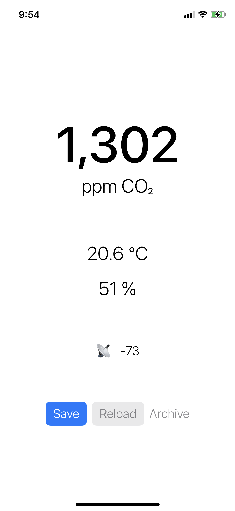
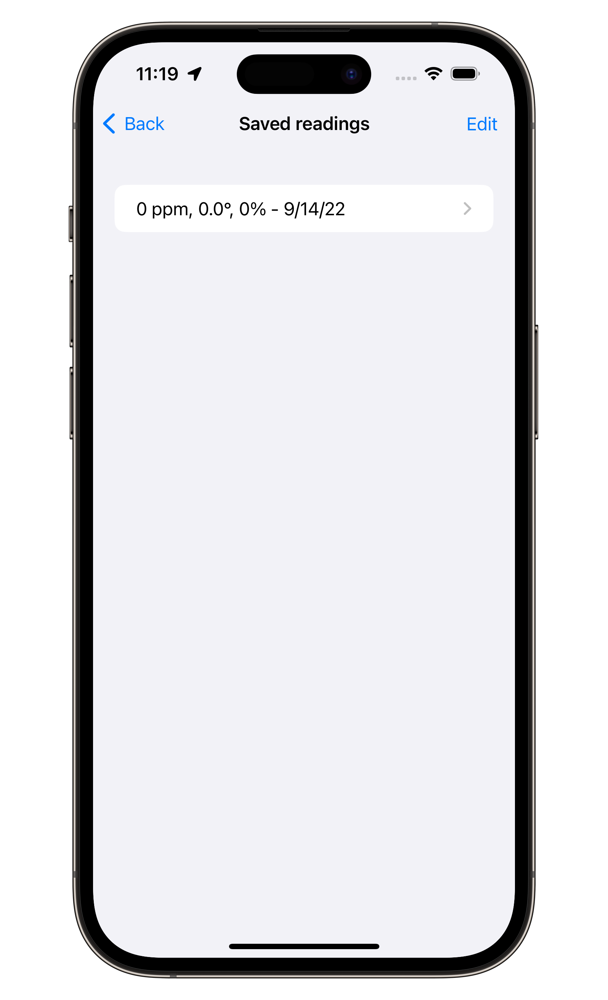
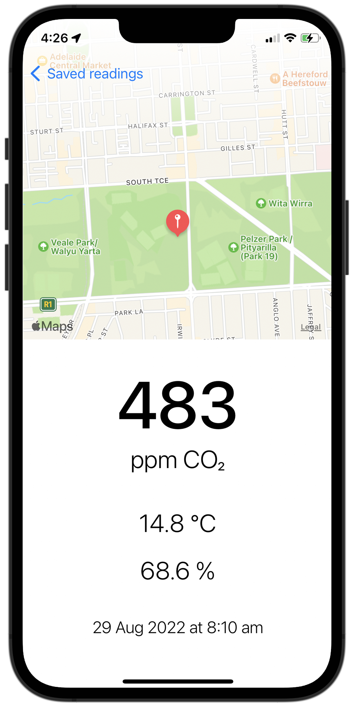
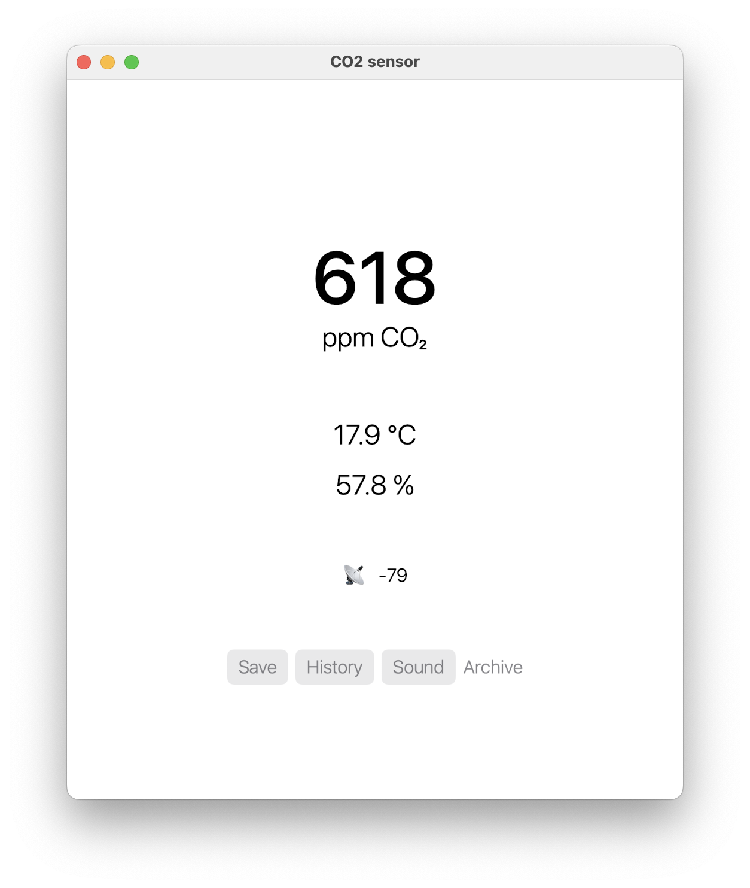
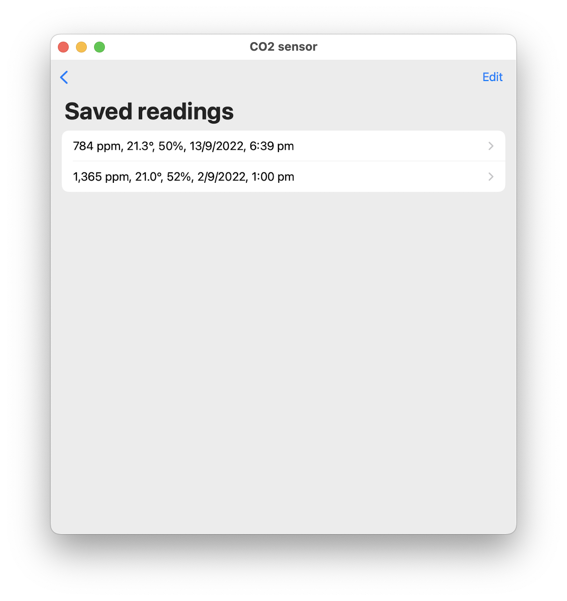
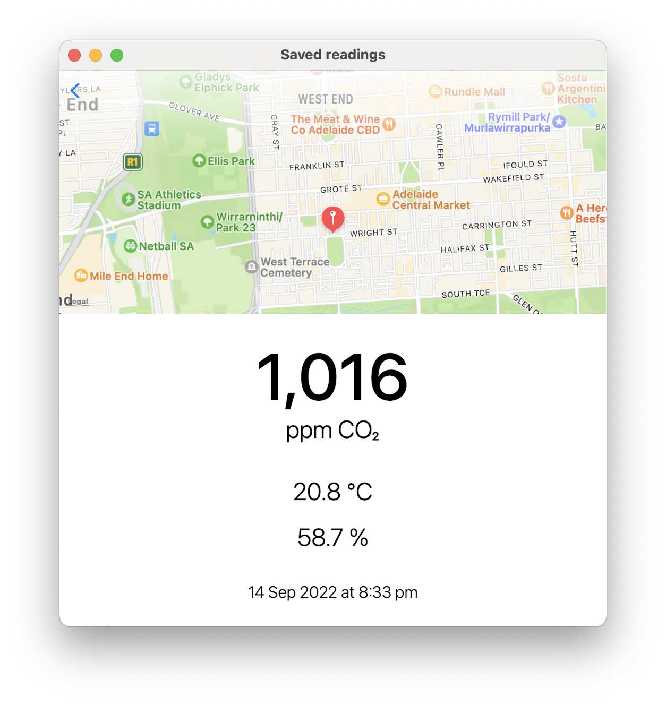

# A Bluetooth CO2 monitor app for iOS/macOS

An iOS/macOS app to read Sensirion SCD-41 CO2 sensor readings written in SwiftUI.

## Hardware

* [ESP32-C3](https://core-electronics.com.au/adafruit-qt-py-esp32-c3-wifi-dev-board-with-stemma-qt.html)
* [Lipo charger](https://core-electronics.com.au/adafruit-liion-or-lipoly-charger-bff-add-on-for-qt-py.html)
* [SCD-41](https://core-electronics.com.au/adafruit-scd-41-ndir-co2-temperature-and-humidity-sensor-stemma-qt-qwiic.html)
* [Qwiic cable](https://core-electronics.com.au/flexible-qwiic-cable-50mm.html)
* [JST 2-pin cable](https://core-electronics.com.au/jst-2-pin-cable.html)
* Nokia BP-6MT 3.7V battery

## Software

* [Arduino ESP32-C3 BLE and HTTP exporter](https://github.com/sighmon/co2_sensor_scd4x_esp32_http_server/tree/add/4-adafruit-qt-py-esp32-c3)
* Clone this repo, open in Xcode, tap run
* The app will auto-detect the CO2 sensor and show live data
* Tap the `Save` button to save the current reading shown
* Tap the `History` button to show the readings since the sensor was turned on
* Tap the `Sound` button to play two notes when a sensor reading happens - it first plays middle C corresponding to 1,000 ppm CO2, and then a second note corresponding to the current sensor reading
* Tap the `Archive` button to see a list of readings saved to Core Data

## TODO

- [x] Download historic data
- [x] Read realtime data
- [x] Add location data to saved sensor readings
- [x] Add ability to run on macOS
- [ ] Add [iOS 16 Chart](https://developer.apple.com/documentation/charts) for last 10 readings ([tutorial](https://www.appcoda.com/swiftui-line-charts/))
- [ ] Add [macOS menu item](https://sarunw.com/posts/swiftui-menu-bar-app/)
- [ ] Export to InfluxDB
